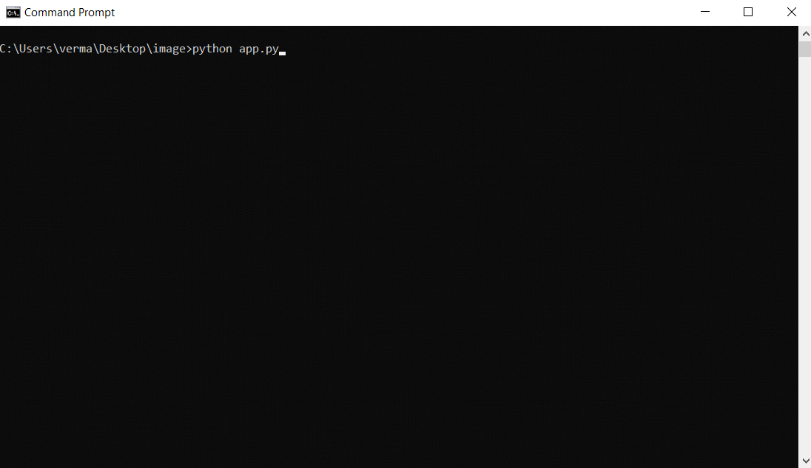

# Image-stitching-using-openCV
This repo contains the source code which performs stitching of two images using openCV.For the web interface Flask Framework has been used.

 Image stitching or photo stitching is the process of combining multiple photographic images with overlapping fields of view to produce a segmented panorama or high-resolution image.
The algorithm we’ll be using here today is similar to the method proposed by Brown and Lowe in their 2007 paper, Automatic Panoramic Image Stitching with Invariant Features.

To run the flask app you would have clone the repo and then run the following command:

```console
python app.py
```
Here is a GIF demonstrating the various stages through the web application.

